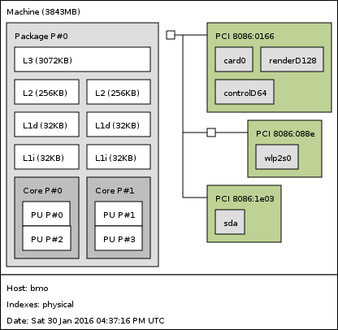

************************
Librairies Scientifiques
************************

Bash
====

La commande bash parallel permet de prendre une liste d'arguments
et de les appliquer en parallele à une ligne de commande::

    $ ls *.log | parallel pygrep -e ".*ENTRY.*\\d+-\\d+-\\d+.*" {}

La commande time peut donner une idée de la paralélisabilité d'un programmme

.. code-block:: text

    $ time
    real    0m5.231s
    user    0m0.072s
    sys     0m0.088s

La règle approximative est:

    - ``real < user``: The process is CPU bound and takes advantage of
      parallel execution on multiple cores/CPUs.
    - ``real ≈ user``: The process is CPU bound and takes no advantage of
      parallel exeuction.
    - ``real > user``: The process is I/O bound. Execution on multiple cores
      would be of little to no advantage.

Profiling
=========

profile
-------

.. code-block:: python

    import cProfile, pstats, io
    pr = cProfile.Profile()
    pr.enable()
    # ... do something ...
    pr.disable()
    s = io.StringIO()
    sortby = 'cumulative'
    ps = pstats.Stats(pr, stream=s).strip_dirs().sort_stats(sortby)
    ps.print_stats()
    print(s.getvalue())

valgrind
--------

En plus de valgrind, on peut utiliser kcachegrind qui permet d'explorer
les arbres d'appels::

    $ valgrind --tool=callgrind <cmd>  # assez lent
    $ kcachegrind callgrind.out.<pid>

Parallélisation
===============

Organisation du processeur
--------------------------

Les commandes::

    $ hwloc-ls
    $ lstopo

permettent de savoir quelle est l'organisation des processeurs et caches. Ça peut donner
pas mal d'informations sur la manière de bien optimiser son code.

threading
---------

La communication constante entre le programme principal et le thread
pour savoir s'il peut switcher vers un autre thread, est la raison
pour laquelle le le Threading n'est pas génial en python.

Les sémaphores sont des locks pour lesquels on peut définir un nombre de
ressources disponibles.

Les Queues permettente de faire des Piles ou des files d'attentes

multiprocessing
---------------

En plus des locks, sémaphores et queues, on peut utiliser des barrières et les
Pools de processus::

    import os
    from multiprocessing import Pool

    def cube(n):
        r = n ** 3
        print("(%s) le cube de %s est %s" % (os.getpid(), n, r))
        return r

    pool = Pool(4)
    r = pool.map(cube, range(10))

    print(r)

Numpy
=====

Il est possible de recompiler Numpy avec des options spécifiques aux architectures
matérielles (x86, arm, etc...).
On peut, pour certaines opérations gagner un facteur 100 sur les performances.

La commande::

    numpy.__config__.show()

permet de voir avec quelle librairies numpy a été compilé.

Les librairies disponibles sont:

    - `BLAS <http://www.netlib.org/blas/>`_ (Basic Linear Algebra Software)
    - `ATLAS <http://math-atlas.sourceforge.net/>`_ (Automatically Tune Linear Algebra Software)
    - `LAPACK <http://www.netlib.org/lapack/>`_ (Linear Algebra PACKage)
    - `OpenBLAS <http://www.openblas.net/>`_
    - `MKL <https://software.intel.com/en-us/intel-mkl/>`_ (par Intel, payant)

ATLAS
-----

Prérequis
^^^^^^^^^

La commande::

    $ cat /sys/devices/system/cpu/cpu0/cpufreq/scaling_governor

donne des infos sur la gestion de la fréquence CPU.

Comme on souhaite désactiver la gestion fine de cette fréquence, pour qu'ATLAS
ait tout le temps la fréquence maximale, on peut utiliser

.. code-block:: shell

    $ cpupower frequency-info
    $ cpupower frequency-set --governor {performance|powersave}
    $ cpupower frequency-set --max <max> --min <min>

    $ # Surveillance de la fréquence réelle
    $ watch grep \"cpu MHz\" /proc/cpuinfo

Compilation
^^^^^^^^^^^

Dans le root d'un virtualenv, créer le dossier ``packages``, dans lequel on place
les sources de ATLAS (décomprésées) et LAPACK (dans son tgz).

.. code-block:: shell

    $ mkdir <dossier_atlas>/build
    $ cd <dossier_atlas>/build
    $ ../configure --with-netlib-lapack-tarfile=<path>/lapack-3.6.0.tgz --prefix=<dossier_install> --shared -D c -DPentiumCPS=<freq> -Fa alg '-march=native -Ofast' -Fa acg '-march=native -O3' --force-tids="2 0 1"
    $ make

    $ # Vérifications des la librairie
    $ make check
    $ make ptcheck
    $ make time

    $ # Installation dans <dossier_install>
    $ sudo make install

Les options de ``--force-tids`` permettent de sélectionner les threads pour chaque coeurs.
Il ne faut en sélectionner qu'un par coeur et pour ça ``hwloc-ls`` permet de savoir quels
threads sont associés à quels cores.
Dans l'exemple, on en utilise 2, les threads 0 et 1.

Installation dans numpy
^^^^^^^^^^^^^^^^^^^^^^^

.. code-block:: shell

    # On dit au compilo où chercher la librairie
    export LD_LIBRARY_PATH=<dossier_install>/lib:$LD_LIBRARY_PATH
    export LIBRARY_PATH=<dossier_install>/lib:$LIBRARY_PATH

    # L'installation de numpy se fait avec la librairie compilée
    pip install numpy

Fonctions utiles
----------------

.. code-block:: python

    # Créer une matrice initialisée avec des valeurs suivants une fonction
    np.fromfunction(lambda i, j: i + 10 * j, (4,4), dtype=int)
    a = array([
        [ 0, 10, 20, 30],
        [ 1, 11, 21, 31],
        [ 2, 12, 22, 32],
        [ 3, 13, 23, 33]])

    # lecture/ecriture de fichiers
    np.save('data.npy', a)
    np.savetxt('data.txt', a)
    b = np.arange(12)
    np.savez('data2.npz', a=a, b=b)

    # lecture de tous les types
    data = np.load("data.npz")

**Création d'un nouveau type**::

    b = np.array([(False, 10.), (True, 5.5)], dtype="b1,f8")
    print(b, b.ndim, b.shape, b.size, b.dtype)
    [(False, 10.0) (True, 5.5)] 1 (2,) 2 [('f0', '?'), ('f1', '<f8')]
    a = b[0]
    print(a, type(a), a['f0'], a['f1'])
    # équivalent à print(a, type(a), a[0], a[1])

C'est quand même un peu pas terrible comme ça, du coup on peut créer son
propre type::

    dt = np.dtype([('time', [('min', int), ('sec', int), ('temp', float)])])
    b = np.zeros((3, 3), dtype=dt)
    print(b)
    # [[((0, 0, 0.0),) ((0, 0, 0.0),) ((0, 0, 0.0),)]
    #  [((0, 0, 0.0),) ((0, 0, 0.0),) ((0, 0, 0.0),)]
    #  [((0, 0, 0.0),) ((0, 0, 0.0),) ((0, 0, 0.0),)]]

On peut faire des trucs assez chaud pour faire des moyennes par blocks de matrices
du genre::

    interp_X = X.reshape([SIZE / N, N, SIZE / N, N]).mean(3).mean(1)
    interp_Y = Y.reshape([SIZE / N, N, SIZE / N, N]).mean(3).mean(1)
    interp_Z = Z.reshape([SIZE / N, N, SIZE / N, N]).mean(3).mean(1)

    # Equivalent de ...
    interp_X = np.zeros((SIZE / N, SIZE / N))
    interp_Y = np.zeros((SIZE / N, SIZE / N))
    interp_Z = np.zeros((SIZE / N, SIZE / N))
    for i in np.arange(0, SIZE, N):
        for j in np.arange(0, SIZE, N):
            interp_X[i/N,j/N] = X[i:i+N,j:j+N].mean()
            interp_Y[i/N,j/N] = Y[i:i+N,j:j+N].mean()
            interp_Z[i/N,j/N] = Z[i:i+N,j:j+N].mean()

Précision numérique
===================

``sys.float_info`` donne des informations sur la précision numérique de la plateforme

    >>> 0.1 + 0.1 + 0.1
    0.30000000000000004
    >>> 0.1 + 0.1 + 0.1 == 0.3
    False
    >>> 0.1.as_integer_ratio()
    (3602879701896397, 36028797018963968)

Bon article `ici <goldberg>`_.

.. _goldberg: http://docs.oracle.com/cd/E19957-01/806-3568/ncg_goldberg.html

Pour limiter les problèmes dans la gestion de devises par exemple, il faut limiter
l'utilisation des divisions (ou contrôler les restes) et faire toutes les opérations
en centimes.

Celery
======

Répartir un traitement sur plusieurs microprocesseurs, sur la même machine, ou sur des machines différentes (cluster, grid, cloud, etc.).

Celery permet ce genre de topologies, mais de manière transparente pour
l'utilisateur. Il suffit de lancer des *Workers* qui vont se mettre en relation
avec un serveur (par défaut `RabbitMQ <https://www.rabbitmq.com/>`_).
Celui-ci leur donnera des tâches à faire.

Il faut commencer par définir les tâches à réaliser.

.. code-block:: python

    # cel.py
    from celery import Celery

    app = Celery("SuperDuperApp")

    @app.task
    def add(x, y):
        return x + y

On va ensuite créer un worker

.. code-block:: shell

    $ celery worker -A cel --loglevel=info

Et lancer notre première tâche

.. code-block:: python

    >>> from cel import add
    # Lancement normal
    >>> add(2, 2)
    4
    >>> add.delay(2, 2)  # envoi de la tâche au worker
    <AsyncResult: 2e4b5dff-539c-42f0-9763-5e8ff9041b4d>
    >>> add.delay(2, 2).get()  # envoi et récupération du résultat
    4

On peut également appeler la tâche avec d'autres méthodes que ``delay``

**delay**
    Envoie la tâche à réaliser directement à un worker. Méthode raccourcie
    de ``apply_async``.

**subtask**
    Ces objets permettent de préparer une tâche avant de l'envoyer au worker.
    Il faut appeler ``delay`` dessus pour envoyer la tâche au worker::

        >>> s = add.subtask((2, 2), countdown=5)
        >>> s.delay()  # envoi au worker
        <AsyncResult: 0fa7769c-66d9-4030-b943-5c19afc872f0>

**group**
    Permet de grouper plusieurs ``subtask`` en un seul appel::

        g = group(add.s(i, i) for i in range(10))
        result = g().get()
        # Équivalent de 
        g = [add.delay(i,i) for i in range(10)]
        result = [r.get() for r in g]

**chain**
    Quand le résultat d'une opération est un argument d'une seconde
    opération::

        # Passe le résultat du add en premier argument de mul
        c = chain(add.s(2,2) | mul.s(8))

**chord**
    Regroupe ``chain`` et ``group`` en un seul appel::

        chord((add.s(i,i) for i in range(10)), my_sum.s())
        # Équivalent à
        chain(group(add.s(i,i) for i in range(10)) | my_sum.s())

