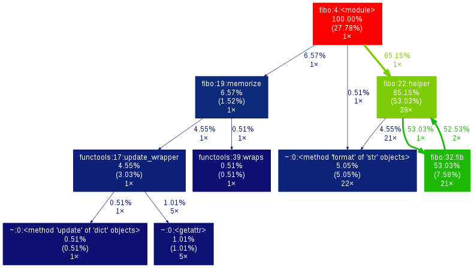

.. doc documentation master file, created by
   sphinx-quickstart on Thu Jan 29 08:09:33 2015.
   You can adapt this file completely to your liking, but it should at least
   contain the root `toctree` directive.

####################
Documentation Python
####################

:Author: Jules DAVID
:Generated: |today|
:Version: |release|

Cette documentation couvre tous les petits trucs et astuces vus ici et là.
L'initialisation de cette page est tirée des notes personnelle prises durant
le cours **Python Avancé** reçu en décembre 2014 et donné par
`Jean-Philippe Camguilhem <https://github.com/jpcw>`_ de
`Makina-Corpus <http://makina-corpus.com/>`_.

sys.path
========

La liste :py:obj:`sys.path` a pour rôle de définir, pour python, les
emplacements où il doit chercher les librairies à charger.

Bien que déconseillé, il est possible de modifier ``sys.path`` pour permettre
de charger dynamiquement des librairies.

Par défaut, celle-ci prend la valeur du dossier contenant le script lancé, de
la variable d'environnement :envvar:`PYTHONPATH`, l'emplacement de la stdlib
et le site-packages, dans cet ordre.

Mémoire
=======

En python les variables n'ont pas le même fonctionnement qu'en C. Toutes sont
des pointeurs vers des emplacements mémoires.

Le mot clé :keyword:`is` permet une comparaison des emplacements mémoires. Il
ne faut pas le confondre avec ``==`` qui lui compare les valeurs.

Le mot-clé :keyword:`is` fait en fait appel à la fonction :py:func:`id`, qui
retourne l'emplacement mémoire pointé par la variable::

    >>> a = 25614
    >>> b = 25614
    >>> a == b
    True
    >>> a is b
    False
    >>> id(a)
    32271488
    >>> id(b)
    32271296
    >>> b = a
    >>> a is b
    True

.. warning:: Les nombres de 0 à 255 et les caractères ASCII sont mises en
    mémoire par l'intérpréteur python avant le démarage de toute application.
    Ainsi, deux variables ayant la même valeur, contenue dans ces domaines,
    pointerons vers le même emplacement mémoire.

    De même ``None`` n'a qu'un emplacement mémoire.

.. code-block:: python

    >>> a = 192
    >>> b = 192
    >>> a is b
    True

Conditions
==========

En python tout est vrai, sauf ``0``, ``False``, ``None`` et tous les conteneurs
vides (``""``, ``()``, ``[]``, ``{}``, etc.).

On peut surcharger ça sur un objet en utilisant les méthodes
:py:meth:`__nonzero__` ou :py:meth:`__len__` (si :py:meth:`__nonzero__` n'est
pas défini).

Muable/Immuable
===============

Les objets pythons sont soit muable, soit immuable (*mutable*/*immutable* en
anglais).

Un objet **immuable** n'accèpte pas de modification *in-place*, mais créera un
nouvel emplacement mémoire si on tente de le modifier. C'est le cas des types
*simples* comme les :py:obj:`tuple`, :py:obj:`str`, :py:obj:`int`,
:py:obj:`float`, etc.::

    >>> a = 658942
    >>> id(a)
    32271488
    >>> a += 614
    >>> id(a)
    33800192

Un objet **muable** garde son emplacement mémoire lorsqu'il est modifié. C'est
le cas notemment des séquences (:py:obj:`list`, :py:obj:`dict`, :py:obj:`set`,
etc.) sauf les :py:obj:`tuple` et :py:obj:`frozenset`.

C'est aussi le cas des objets créés par le développeur.

Séquences
=========

Désigne les :py:obj:`str`, :py:obj:`list`, :py:obj:`dict`, :py:obj:`set`,
:py:obj:`tuple`, :py:obj:`bytearray`, etc.

Voir :ref:`typesseq` pour plus de détails.

:py:obj:`tuple`
---------------

Le tuple est immuable.

:py:obj:`dict`
--------------

Tableau associatif, dont la clé peut être nimporte quelle valeur immuable
(str, int, tuple, etc.).

La méthode :py:meth:`dict.items` retourne la liste complète des couples
clé-valeur sous forme de tuple.

:py:meth:`dict.iteritems` fait la même chose en renvoyant un
:ref:`itérateur <iterateurs>`.
En python3 ``items()`` a le comportement de ``iteritems`` en python2.

Les fonctions :py:meth:`dict.setdefault` et :py:meth:`dict.get` sont à
utiliser lorsqu'on veut avoir une valeur par défaut dans un tableau associatif
si la clé n'existe pas.

:py:obj:`list`
--------------

.. warning:: La suppression d'un élément d'une liste lors d'une itération va
   réorganiser la liste. On peut donc manquer des éléments.

.. code-block:: python

    >>> fruits = ['bananes', 'cerises', 'pommes', 'mangues']
    >>> for fruit in fruits:
    ...     fruits.remove(fruit)
    >>> fruits
    ['cerises', 'mangues']

List comprehension
------------------

Aussi appelé list-inextension, c'est la création de séquences directement. Par
exemple

.. code-block:: python

    >>> fruits = ['banane', 'mangue', 'fraise', 'cerise', 'abricot', 'pomme']
    >>> fruits_i = [fruit for fruit in fruits if 'i' in fruit]
    >>> fruits_i
    ['fraise', 'cerise', 'abricot']

Ce type d'opération fonctionne avec toutes les séquences (list, tuple, dict,
etc.) et est très efficace d'un point de vue CPU.

unpacking
---------

L'unpacking se fait grâce à l'opérateur ``*`` (splat).

En gros ça permet d'extraire des données d'un itérable. Dans certains cas
c'est même automatique

.. code-block:: python

    >>> super_liste = [1, 2, 3]
    >>> a, b, c = super_liste
    >>> a
    1
    >>> b
    2
    >>> c
    3

En python 3 on peut même faire de l'unpacking partiel

.. code-block:: python

    >>> super_liste = [1, 2, 3, 4]
    >>> a, *b = super_liste
    >>> a
    1
    >>> b
    [2, 3, 4]
    >>> super_liste = [1, 2, 3, 4]
    >>> a, *b, c = super_liste
    >>> a
    1
    >>> b
    [2, 3]
    >>> c
    4

On peut aussi l'utiliser directement dans une boucle

.. code-block:: python

    >>> a = [[1, 'hello'],[2, 'world']]
    >>> for i, word in a:
    ...     print("%d %s" % (i, word))
    ...
    1 hello
    2 world

Mais là où l'unpacking est surtout utile c'est pour passer des arguments à
une fonction

.. code-block:: python

    >>> def add(a, b, c):
    ...     return a + b + c
    ...
    >>> add(1, 2, 3)
    6
    >>> values = [1,2,3]
    >>> add(*values)

Ça marche également avec les :py:obj:`dict` en argument de fonction, mais dans
ce cas il faut utiliser le double ``*``.

.. code-block:: python

    >>> def fonction_bizarre(arg1, arg2):
    ...     print("mon arg1 est {0}".format(arg1))
    ...     print("mon arg2 est {0}".format(arg2))
    ...
    >>> args = {'arg1': 'hello', 'arg2': 'world'}
    >>> fonction_bizarre(**args)
    mon arg1 est hello
    mon arg2 est world

Optimisation
------------

L'utilisation de boucles pour parcourir des tableaux est très coûteuse,
surtout lorsqu'il y a des imbrications. Tous les objets ne sont pas égaux face
à ce problème, les objets "rapides" sont, dans l'ordre:

    #. :py:obj:`dict`
    #. :py:obj:`tuple`
    #. :py:obj:`list`

On peut également utiliser les objets :py:obj:`array.array`, qui permettent de
faire des tableaux d'un seul type d'objet.

Numpy et Scipy font appel à des optimisations en C et permettent donc de gérer
des objets volumineux plus facilement.

L'utilisation de Cython et PyPy permet de faire gagner en vitesse d'exécution.

On peut, quand c'est possible utiliser les :ref:`générateurs <generateurs>`,
comme :py:func:`xrange` à la place de :py:func:`range`.

Les list-comprehension sont plus rapides qu'une boucle for classique.

La fonction :py:func:`map` est également rapide, mais il vaut mieux éviter
d'utiliser les :ref:`lamba-functions <tut-lambda>`, car elles sont
ré-interprétées à chaque élément.

Enfin, les fonctions et méthodes préfixées de ``c*`` sont souvent une
ré-implémentation en C du module, souvent beaucoup plus rapide.

Autres types de séquences
-------------------------

On peut également aller voir sur :py:mod:`collections` et le tuto sur
`PyMOTW <http://pymotw.com/2/collections/index.html>`_ pour avoir de nouveaux
types (:py:obj:`collections.namedtuple`, :py:obj:`collections.OrderedDict`, etc.).

.. _iterateurs:

Itérateurs
----------

Voir :ref:`typeiter`.

.. _generateurs:

Générateurs
-----------

Voir :ref:`generator-types`.

Chaines de caractères
=====================

Formatage
---------

.. code-block:: python

    >>> # MAAAAAAL
    >>> text = 'text ' + str(1) + ' another text ' + str(2) + ' fini'

    >>> # Bien !
    >>> text = 'text %d another text %d fini' % (1, 2)
    >>> text = 'text {0} another text {1} fini'.format(1, 2)
    >>> text = 'text {premier} another text {second} fini'.format(premier=1, second=2)

La concatenation de chaines de caractères est beaucoup plus rapide en passant
par string.join() que par concaténation directe (+). Il faut donc le préférer
pour de grands ensembles de données.

Pour la lecture de fichiers, préférer splitline

.. code-block:: python

    with open('text.txt') as f:
        for lines in f.read().splitlines():
            # Action !

Pour la lecture de fichier avec des encodages autres que ASCII utiliser
:py:meth:`codecs.open` pour directement spécifier l'encodage du fichier à lire
et éviter d'avoir à faire de decode.

Les remplacements sont plus efficaces avec :py:meth:`string.translate` que par
:py:meth:`string.replace` pour les caractères.

Encoding
--------

Une chaine de caractère (:py:obj:`str`) est une séquence d'octets.
Par défaut python2 est en ASCII. Par contre dans un termial, python détecte
l'encoding du tty et accèpte donc son encodage (ex : utf-8).

Il y a une **différence** entre la représentation **unicode** et l'encoding
**utf-8**.

Python peut convertir de charset/codepage/encoding vers unicode grâce à la
commande :py:meth:`string.decode` et l'inverse via :py:meth:`string.encode`.

La bonne méthode est :
    #. tout récupérer,
    #. décoder vers unicode avec decode(),
    #. faire les opérations en unicode,
    #. puis faire encode() au dernier moment (avant :py:func:`print` ou
       :py:meth:`file.write`)

.. warning:: DANGER !!

.. code-block:: python

    >>> 'héhé'.isalpha()
    False
    >>> u'héhé'.isalpha()
    True

Path
====

Il ne faut jamais concatener soi-même les path, car :py:mod:`os.path` c'est la
vie !

Dans la stdlib de python 3.4 (et PyPy) :py:mod:`path` est super cool et permet
de faire un objet Path, sur lequel on peut faire un join(), rename(), move(),
chown(), etc.

Pour la création de fichiers temporaires :py:mod:`tempfile`.

Scope
=====

Une variable est accessible depuis n'importe quel sous-scope en lecture, mais
pas en écriture.
Pour pouvoir la modifier dans un sous-scope, il faut la décraler comme
:keyword:`global`, mais c'est :ref:`mal ! <mal>`

.. code-block:: python

    variable = 40

    def modifier(value):
        variable += value
        # Renvoie une UnboundLocalError
        return variable

    def modifier(value):
        # Fonctionne
        return variable + value

    def modifier(value):
        global variable
        variable += value
        # Fonctionne mais à éviter
        # parce que global CAYMAL
        return variable

Fonctions
=========

La valeur par défaut d'un argument d'une fonction n'est évalué qu'une fois
lors de la déclaration. Ainsi si elle fait référence à un objet qui n'existe
pas encore, il y aura erreur.

Boucles
=======

On peut utiliser la méthode :keyword:`for`-:keyword:`else`. Le code contenu
dans ``else`` ne sera exécuté que dans le cas ou for n'est pas interrompu ou
breaké.

Le même principe est applicable à :keyword:`while`-:keyword:`else`.

Exceptions
==========

.. code-block:: python

    >>> try:
    ...     x = 5/0
    ... except:
    ...     print "Hello, il y a une erreur"
    ...     raise
    ... finally:
    ...     print "Je passe ici quoiqu'il arrive"
    ...
    Hello, il y a une erreur
    Je passe ici quoiqu'il arrive
    Traceback (most recent call last):
      File "<input>", line 2, in <module>
    ZeroDivisionError: integer division or modulo by zero

POO
===

MRO
---

Quoi qu'il arrive, hériter de :py:obj:`object`. On bénéficie alors du
:abbr:`MRO (Method Resolution Order)`, qui permet de se débrouiller avec
l'héritage multiple. Cf. le tuto de `Makina Corpus <http://makina-corpus.com/blog/metier/2014/python-tutorial-understanding-python-mro-class-search-path>`_.

Conventions de nommage
----------------------

Une méthode ou variable préfixée d'un underscore ``_`` n'a, par covention,
pas vocation à être utilisée à l'extérieur de la classe. Cependant, comme il
n'y a pas de notion de visibilité d'attributs et de méthodes, on n'empèche
personne de le faire.

De même, les méthodes encadrées par des double-underscore (par exemple
``__init__``) sont des méthodes spéciales.

Setters/Getters
---------------

Les setters et getters sont implicites en python, on peut cependant les créer
pour permettre une validation des entrées/sorties.

@property
^^^^^^^^^

Transforme une méthode en attribut (read-only)::

    >>> class Parrot(object):
    ...     def __init__(self):
    ...         self._voltage = 100000
    ...
    ...     @property
    ...     def voltage(self):
    ...         """Get the current voltage."""
    ...         return self._voltage
    >>> parrot = Parrot()
    >>> parrot.voltage
    100000
    >>> parrot.voltage = 50
    Traceback (most recent call last):
      File "<input>", line 1, in <module>
    AttributeError: can't set attribute
    >>> parrot._voltage = 40
    >>> parrot.voltage
    40

@x.setter & x.deleter
^^^^^^^^^^^^^^^^^^^^^

Dans l'exemple d'avant la classe ``Parrot`` devient::

    class Parrot(object):

        def __init__(self):
            self._voltage = 10000

        @property
        def voltage(self):
            return self._voltage

        @voltage.setter
        def voltage(self, value):
            self._voltage = value

        @voltage.deleter
        def voltage(self):
            raise Exception("Impossible de supprimer cet élément")

decorateurs
-----------

On peut créer ses propres décorateurs, de manière à ajouter une
fonctionnalitée particulière. Par exemple, le décorateur suivant permet de
mettre en cache les sorties d'une fonction::

    from functools import wraps

    def memorize(func):
        memo = {}
        @wraps(func)
        def memorized_func(func_arg):
            if x not in memo:
                memo[func_arg] = f(func_arg)
            return memo[x]

        return memorized_func

    @memorize
    def fib(n):
        if n == 0:
            return 0
        elif n == 1:
            return 1
        else:
            return fib(n-1) + fib(n-2)

Le décorateur :py:func:`wraps` permet de faire passer le ``__doc__`` et le
``__name__`` de la fonction décorée (fib) à la fonction décoratrice (_memorize).

Des version sympa de décorateurs sont disponibles sur ce
`wiki <https://wiki.python.org/moin/PythonDecoratorLibrary>`_:

    * deprecated
    * timing
    * retry

Autre
-----

+-------------------+---------------------------------------------------------------------------------------------------+
| ``__slots__``     | Pour la linéarisation d'objets, on sélectionne les attributs qui seront conservés en mémoire      |
|                   | (à la manière de __all__ pour les modules)                                                        |
+-------------------+---------------------------------------------------------------------------------------------------+
| ``__call__``      | Rend l'objet appellable                                                                           |
+-------------------+---------------------------------------------------------------------------------------------------+
| ``__[a-Z0-9]+_?`` | Les attributs préfixés de 2 « _ » et d'un « _ » au plus en suffixe sont des attributs spéciaux.   |
|                   | Ils n'est pas possible de les overrider dans les classes filles.                                  |
+-------------------+---------------------------------------------------------------------------------------------------+

Métaclasses
===========

Fabriquer des classes à la volée, équivalent des :keyword:`lambda` mais pour
les classes.

Le constructeur d'une classe se fait en deux étapes.

    #. Le __new__ s'occupe de créer la classe
    #. le __init__ s'occupe de créer de l'instance.

En définissant le __new__ on peut donc créer une classe en lui ajoutant des
attributs et méthodes.

.. warning:: Attention, une classe de ce type doit hériter de :py:obj:`type`.

.. code-block:: python

    class MyClass(type):
        def __new__(cls, name):
            # ...

.. todo Compléter l'exemple

On peut également créer des métaclasse grâce à l'outils abc.

Le singleton
============

Cet objet, qui est un objet qui ne peut être estancié qu'une seule fois.
C'est dans la méthode __new__ que cela doit être fait.

Il existe un pattern de Singleton alternatif : le Borg. Il permet le partage
des états entre objets.

Context Manager
===============

:py:func:`contextlib.contextmanager`. Une utilisation régulière est

.. code-block:: python

    with open('file.txt') as f:
        # on fait des trucs ici

qui s'occupe de refermer le fichier automatiquement en fin d'utilisation.
C'est un mix de décorateur et générateur.
C'est très intéressant dans le cas de socket, connexions à des BDD, ouvertures
de fichierts, etc.
Voir l'article de `Sam\&Max <http://sametmax.com/les-context-managers-et-le-mot-cle-with-en-python/>`__.

Modules
=======

À chaque niveau d'arborescence, il faut mettre un fichier ``__init__.py``. Il
doit contenir au moins 1 caractère pour d'obscures raisons de suppression de
fichiers vides par windows lors des zip/unzip.

Outils
------

virtualenv
^^^^^^^^^^

Isolation de l'environnement python. On a cloné le binaire python, donc on ne
suit pas les mises à jours faites par le système. La librairie standard est
liée dynamiquement (symlink). On peut l'activer en faisant
``virtualenv <dossier>`` puis source ``<dossier>/bin/activate``.

setuptools
^^^^^^^^^^

.. code-block:: shell

    python setup.py develop

permet de faire un lien symbolique vers la librairie en cours de développement.

pip
^^^

Gère (mal) les dépedances des paquets.

buildout
^^^^^^^^

Gestionnaire d'installation et de dépendences, qui permet apparement d'isoler
de gérer assez finement les impacts que ça peut avoir sur le système
(site-packages, versions concurentes). Il y de gros tutos et guides
sur le `site officiel <http://www.buildout.org/en/latest/>`_.

À installer depuis `bootstrap <http://downloads.buildout.org/2/bootstrap.py>`_,

Fonctionne sur le modèle des recipes

.. todo:: à compléter

Lu ici-et-là qu'il est quand même assez lourd et difficilement configurable.

Debug
=====

.. code-block:: python

    import pdb; pdb.set_trace()

* ``l`` affiche le contexte
* ``a`` affiche les variables
* ``c`` continue
* ``n`` ligne suivante

:pep:`8`
========

Les commandes ``pep8`` et ``flake8`` permettent de vérifier si la mise en
forme du code source est conforme aux standards de codage python, la :pep:8
et sont installables via pip.

Tests unitaires
===============

doctest
-------

.. code-block:: python

    def compute(nba, nbb):
        """Doc here

        >>> compute(2,3)
        5

        >>> compute(2, '3')
        Traceback (most recent call last):
        ...
        TypeError: unsupported operand type(s) for +: 'int' and 'str'

        >>> compute(5,5,2)
        Traceback (most recent call last):
          File "<input>", line 1, in <module>
        TypeError: compute() takes exactly 2 arguments (3 given)

        """
        return nba + nbb

.. code-block:: python

    python -m doctest -v <fichier.py>

On peut déporter les test dans un fichier \*.txt pour ne pas trop surcharger
la docstring.

Cf. `Sam\&Max <http://sametmax.com/un-gros-guide-bien-gras-sur-les-tests-unitaires-en-python-partie-4/>`__

unitttest
---------

.. code-block:: python

    import unittest

    class TestTools(unittest.TestCase):

        def testCompute(self):
            from cs.formation import compute

            self.assertEquals(compute(2,5), 7)
            self.assertRaises(TypeError, compute, 2,'3')
            self.assertRaises(TypeError, compute, 2, 3, 5)

    if __name__ == '__main__':
        unittest.main()

Cf. `Sam\&Max <http://sametmax.com/un-gros-guide-bien-gras-sur-les-tests-unitaires-en-python-partie-2/>`__

nosetest
--------

.. code-block:: shell

    pip install nose

Permet de lancer des tests de tous types (unittest, doctest, etc) et d'avoir
la couverture de ceux-ci.

.. code-block:: shell

    nosetests --with-doctest --with-coverage -v myProject/

py.test
-------

Très puissant outil de tests, mais fait un peu trop de trucs ésotériques au
niveau des imports. Comme nosetest, il permet de lancer des tests issus
d'autres suites (doctests, unittest, etc.).

Lire l'article de `Sam\&Max <http://sametmax.com/un-gros-guide-bien-gras-sur-les-tests-unitaires-en-python-partie-3/>`__
vachement complet, notamment la partie *Outils* qui liste les extensions
existantes.

On peut citer : 

    * capsys : permet de capturer les stdout/stderr
    * monkeypatch : Modification d'objets à la volée
    * tmpdir : Dossier temporaires

Il y a aussi une foule d'options sympa:

    * ne lancer que les tests dont le nom contient une expression
    * ignorer un path
    * tester aussi les doctest, unittest et nose

tox
---

Si j'ai bien compris, c'est un outil d'automatisation des tests, mais il faut
creuser/vérifier `ici <https://testrun.org/tox/latest/>`_.

Documentation
=============

`Sphinx <http://sphinx-doc.org/>`_ est la clé !

    * Language extensible
    * Génére la liste des todo automatiquement.
    * L'idée c'est de piloter la structuration de la documentation.
    * ``litteralinclude`` pour mettre des morceaux de codes dans le corps de
      page
    * ``automodule`` permet d'aller chercher les docstring d'un module.

Profiling
=========

.. code-block:: shell

    python -m cProfile -o profile.pstats fibo.py

pour avoir le nombre d'appels sur chaque fonction.

.. code-block:: shell

    pip install gprof2dot
    gprof2dot -f pstats profile.pstats | dot -Tpng -o output.png

On peut également utiliser

.. code-block:: shell

    pip install memory_profiler

qui fait du profiling ligne par ligne et fournit également le décorateur
``@profile``.
Par contre ce n'est pas super précis, parce que python n'a que des références.
Ça ne correspond donc pas vraiment à ce qui est fait par python en mémoire.

.. warning:: ça ne remplacera pas gdb pour la détection de fuites.

Librairies sympas
=================

+----------------------------------+-----------------------------------------------------------------------------------+
| Nom                              | Description                                                                       |
+==================================+===================================================================================+
| :py:mod:`__future__`             | Permet d'avoir, en python2, des comportements apparus en python3                  |
|                                  | (unicode partout, print, etc.)                                                    |
+----------------------------------+-----------------------------------------------------------------------------------+
| `BeautifulSoup`_                 |  html et xml, même très mal formatté                                              |
+----------------------------------+-----------------------------------------------------------------------------------+
| csv                              | Parsing de fichiers CSV                                                           |
+----------------------------------+-----------------------------------------------------------------------------------+
| Logging                          | Module de gestion des niveaux de log                                              |
+----------------------------------+-----------------------------------------------------------------------------------+
| lxml                             | Parsing html et xml                                                               |
+----------------------------------+------------------------+----------------------------------------------------------+
| :py:mod:`multiprocessing`        | Utilisent la même API, | Faire des forks comme un fou                             |
+----------------------------------+ ils sont donc          +----------------------------------------------------------+
| :py:mod:`threading`              | facilement             | À préférer à :py:mod:`thread`, mais peut être            |
|                                  | interchangeable        | limité par le :term:`GIL <global interpreter lock>`      |
|                                  |                        | Reste quand même super s'il y a beaucoup d'IO (fichiers, |
|                                  |                        | RAM, etc.).                                              |
+----------------------------------+------------------------+----------------------------------------------------------+
| `Asyncio`_                       | Multi-threading (python3.4, mais existe en non-garanti sous python2,              |
|                                  | sous le nom de trollus).                                                          |
+----------------------------------+-----------------------------------------------------------------------------------+
| `Fabric`_                        | Ssh, pour faire du déploiement par exemple, basé sur paramiko                     |
+----------------------------------+-----------------------------------------------------------------------------------+
| Hachoir                          | Lecture de fichiers, métadonnées, réparations de binaires dégradés                |
+----------------------------------+-----------------------------------------------------------------------------------+
| Paramiko                         | ssh                                                                               |
+----------------------------------+-----------------------------------------------------------------------------------+
| Pickle                           | Sérailisation                                                                     |
+----------------------------------+-----------------------------------------------------------------------------------+
| PIL                              | Python Imaging Library (pip install pillow ou pilotk)                             |
+----------------------------------+-----------------------------------------------------------------------------------+
| Queue                            | Gestion de queues (FIFO, LIFO, etc...)                                            |
+----------------------------------+-----------------------------------------------------------------------------------+
| `Scapy`_                         | Manipulation de paquets réseaux                                                   |
+----------------------------------+-----------------------------------------------------------------------------------+
| South                            | Pour Django (changement de schéma de données)                                     |
+----------------------------------+-----------------------------------------------------------------------------------+
| SQLAlchemy                       | Connection à une BdD SQL                                                          |
+----------------------------------+-----------------------------------------------------------------------------------+
| zodb                             | Bdd historisée et transactionnelle                                                |
|                                  | (très rapide en lecture, mais moins en écriture).                                 |
+----------------------------------+-----------------------------------------------------------------------------------+

.. Liste des liens vers les différentes docs en ligne
.. _Asyncio: https://www.python.org/dev/peps/pep-3156/
.. _BeautifulSoup: http://www.crummy.com/software/BeautifulSoup/bs4/doc/
.. _Fabric: http://docs.fabfile.org/en/1.10/
.. _Scapy: http://secdev.org/projects/scapy/

Sinon il y a la super liste de
`Sam\&Max <http://sametmax.com/tres-grand-listing-des-libs-tierce-partie-les-plus-utiles-en-python/>`__.
Ils essayent de la mettreà jour régulièrement.

.. _mal:

Le mal !
========

``import *``, :py:func:`eval` et :keyword:`global` : c'est **mal** !

Références
==========

* `Doc python officielle <https://docs.python.org/>`_ (attention à choisir la bonne version)
* `Les PEPs <https://www.python.org/dev/peps/>`_
* `Python Module Of The Week <http://pymotw.com/2/>`_ présentation des modules de la stdlib. Très complets
* `Sam\&Max <http://sametmax.com>`__

TODO
====

.. todolist::

Indices et tables
==================

* :ref:`genindex`
* :ref:`search`

